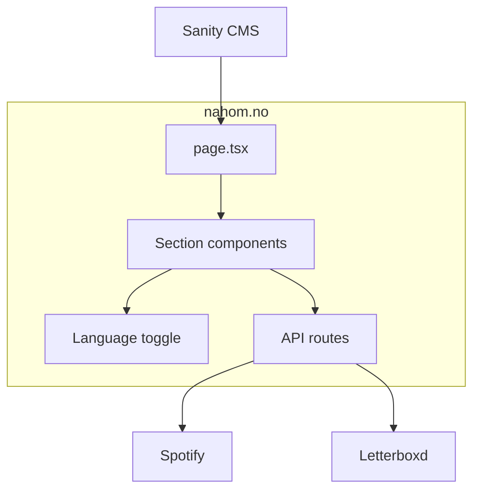
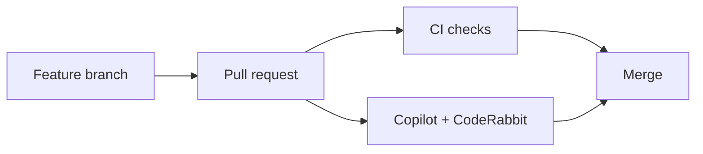

# nahom.no

Personal portfolio for Nahom Berhane — software developer.

A single-page, scroll-driven site with light/dark theme, bilingual EN/NO support, and
content driven by Sanity CMS.

**Docs:** [docs/README.md](docs/README.md) — architecture, CI, PR workflow, and AI review setup.

## Tech Stack

| Layer         | Technology                                             |
| ------------- | ------------------------------------------------------ |
| Framework     | Next.js 16 (App Router) + React 19 + TypeScript        |
| CMS           | Sanity v5 (embedded studio at `/studio`)               |
| Styling       | Tailwind CSS v4                                        |
| Animations    | Motion (Framer Motion v12)                             |
| Theme         | `next-themes` (dark by default)                        |
| i18n          | Sanity `*No` fields + `LanguageProvider`               |
| External APIs | Spotify (now playing), Letterboxd RSS (recent watches) |
| Testing       | Vitest + Testing Library                               |
| CI            | GitHub Actions (lint, format, test, build)             |
| Linting / Fmt | ESLint + Prettier                                      |

## Architecture



## Getting Started

```bash
npm install
cp .env.example .env.local   # then fill in real values
npm run dev                  # Turbopack dev server
```

Open [http://localhost:3000](http://localhost:3000). The Sanity Studio is at
[http://localhost:3000/studio](http://localhost:3000/studio).

## Environment Variables

See `.env.example`. None are strictly required to render the site — sections hide when
CMS data is missing — but they unlock live content:

```bash
# Sanity CMS (content)
NEXT_PUBLIC_SANITY_PROJECT_ID=
NEXT_PUBLIC_SANITY_DATASET=production
SANITY_API_WRITE_TOKEN=          # only for the local content seed script

# Spotify — "Off the clock" now-playing widget
SPOTIFY_CLIENT_ID=
SPOTIFY_CLIENT_SECRET=
SPOTIFY_REFRESH_TOKEN=

# Letterboxd — "Off the clock" recently-watched widget
LETTERBOXD_USER=
```

## Project Structure

```
nahom.no/
├── docs/README.md               # Architecture, CI, PR workflow, AI review
├── sanity/schema.ts             # Sanity document types
├── sanity.config.ts             # Studio config + desk structure
├── tests/                       # Vitest tests (mirrors src/)
├── src/
│   ├── app/
│   │   ├── layout.tsx           # Fonts, theme, analytics
│   │   ├── page.tsx             # Single-page section assembly
│   │   ├── globals.css          # Design tokens (light + dark)
│   │   ├── api/                 # Spotify + Letterboxd proxies
│   │   └── (routes)/studio/     # Embedded Sanity Studio
│   ├── components/
│   │   ├── features/            # One file per page section
│   │   ├── layout/navbar.tsx
│   │   ├── LanguageToggle.tsx
│   │   └── ThemeToggle.tsx
│   └── lib/
│       ├── sanity.ts            # Sanity client + GROQ queries
│       ├── i18n.tsx             # Language context
│       ├── lang.ts              # pickLang / pickListLang
│       ├── cms.ts               # label() helper
│       └── motion.ts            # Shared Motion variants
├── .github/
│   ├── workflows/ci.yml
│   ├── copilot-instructions.md  # Copilot PR review rules
│   └── scripts/setup-branch-protection.sh
├── .coderabbit.yaml             # CodeRabbit PR review config
└── .env.example
```

## Contributing

`main` is protected — all changes go through pull requests.



1. Branch from `main`, make changes, run `npm test` and `npm run build`
2. Open a PR — CI runs Lint, Format, Test, and Build
3. Address Copilot and CodeRabbit feedback
4. Merge when checks pass

First-time repo setup for maintainers:

```bash
gh auth login
.github/scripts/setup-branch-protection.sh   # enforce PR + CI on main
```

Install the [CodeRabbit GitHub App](https://coderabbit.ai/) and enable Copilot code review in repo settings. See [docs/README.md](docs/README.md) for details.

## Scripts

```bash
npm run dev          # Start dev server (Turbopack)
npm run build        # Production build (also type-checks)
npm run start        # Start production server
npm run lint         # ESLint
npm run format       # Prettier write
npm run format:check # Prettier check (CI)
npm test             # Vitest
npm run test:watch   # Vitest watch mode
npm run seed         # Push content to Sanity (scripts/seed.mjs — local only, git-ignored)
```

## Sanity Content Model

The studio (`/studio`) is organized into one **Site Settings** singleton plus content lists.
Document types in `sanity/schema.ts`:

| Type              | Purpose                                                                 |
| ----------------- | ----------------------------------------------------------------------- |
| `siteSettings`    | Site copy, nav labels, section toggles, portrait (EN + `*No` fields)    |
| `workExperience`  | Roles with bilingual descriptions                                     |
| `project`         | Projects with stack, screenshot, link                                   |
| `education`       | Degrees with GPA and location                                           |
| `relevantClasses` | Classes linked to an `education` entry                                  |
| `resume`          | English + Norwegian PDF uploads                                         |

Everything subject to change lives in Sanity so the site can be updated without touching code.
