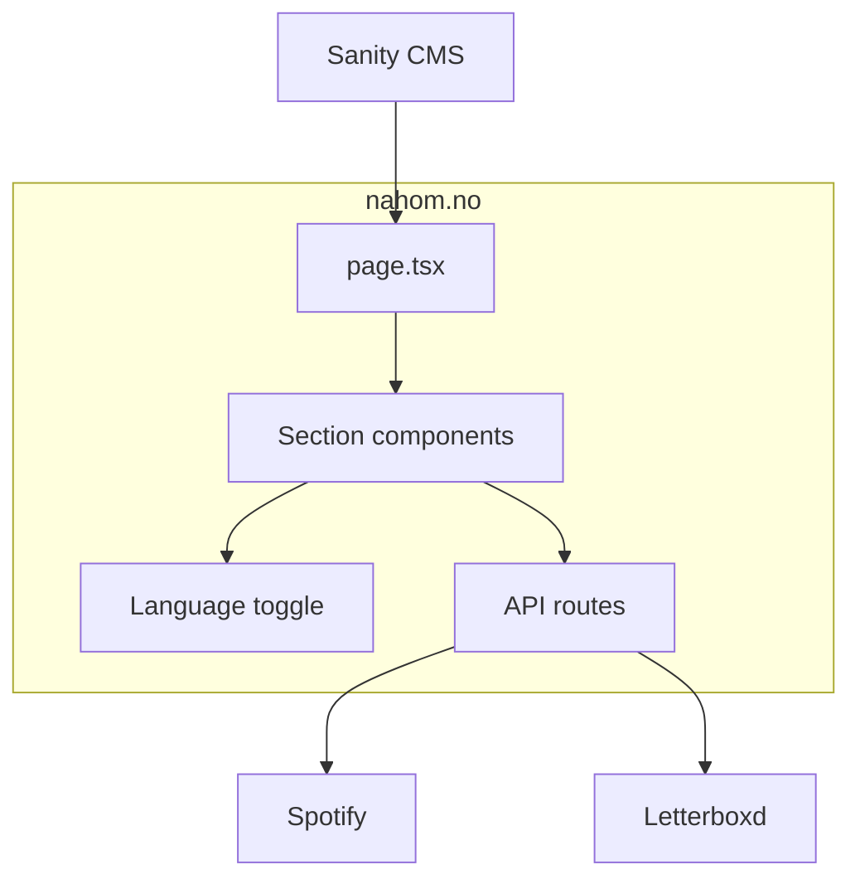

# nahom.no

Personal portfolio for Nahom Berhane — software developer.

A single-page, scroll-driven site with light/dark theme, bilingual EN/NO support, and
content driven by Sanity CMS.

## Tech Stack

| Layer         | Technology                                             |
| ------------- | ------------------------------------------------------ |
| Framework     | Next.js 16 (App Router) + React 19 + TypeScript        |
| CMS           | Sanity v5 (embedded studio at `/studio`)               |
| Styling       | Tailwind CSS v4                                        |
| Animations    | Motion (Framer Motion v12)                             |
| Theme         | `next-themes` (dark by default)                        |
| i18n          | Sanity `*No` fields + `LanguageProvider`               |
| External APIs | Spotify (now playing), Letterboxd RSS (recent watches) |

## Architecture



## Getting Started

```bash
npm install
cp .env.example .env.local   # then fill in real values
npm run dev
```

Open [http://localhost:3000](http://localhost:3000). The Sanity Studio is at
[http://localhost:3000/studio](http://localhost:3000/studio).

## Environment Variables

See `.env.example`. None are strictly required to render the site — sections hide when
CMS data is missing — but they unlock live content:

```bash
# Sanity CMS (content)
NEXT_PUBLIC_SANITY_PROJECT_ID=
NEXT_PUBLIC_SANITY_DATASET=production
SANITY_API_WRITE_TOKEN=          # only for the local content seed script

# Spotify — "Off the clock" now-playing widget
SPOTIFY_CLIENT_ID=
SPOTIFY_CLIENT_SECRET=
SPOTIFY_REFRESH_TOKEN=

# Letterboxd — "Off the clock" recently-watched widget
LETTERBOXD_USER=
```

## Project Structure

```
nahom.no/
├── sanity/schema.ts             # Sanity document types
├── sanity.config.ts             # Studio config + desk structure
├── src/
│   ├── app/
│   │   ├── layout.tsx           # Fonts, theme, analytics
│   │   ├── page.tsx             # Single-page section assembly
│   │   ├── globals.css          # Design tokens (light + dark)
│   │   ├── api/                 # Spotify + Letterboxd proxies
│   │   └── (routes)/studio/     # Embedded Sanity Studio
│   ├── components/
│   │   ├── features/            # One file per page section
│   │   ├── layout/navbar.tsx
│   │   ├── LanguageToggle.tsx
│   │   └── ThemeToggle.tsx
│   └── lib/
│       ├── sanity.ts            # Sanity client + GROQ queries
│       ├── i18n.tsx             # Language context
│       ├── lang.ts              # pickLang / pickListLang
│       ├── cms.ts               # label() helper
│       └── motion.ts            # Shared Motion variants
└── .env.example
```

## Sanity Content Model

The studio (`/studio`) is organized into one **Site Settings** singleton plus content lists.
Document types in `sanity/schema.ts`:

| Type              | Purpose                                                              |
| ----------------- | -------------------------------------------------------------------- |
| `siteSettings`    | Site copy, nav labels, section toggles, portrait (EN + `*No` fields) |
| `workExperience`  | Roles with bilingual descriptions                                    |
| `project`         | Projects with stack, screenshot, link                                |
| `education`       | Degrees with GPA and location                                        |
| `relevantClasses` | Classes linked to an `education` entry                               |
| `resume`          | English + Norwegian PDF uploads                                      |

Everything subject to change lives in Sanity so the site can be updated without touching code.
