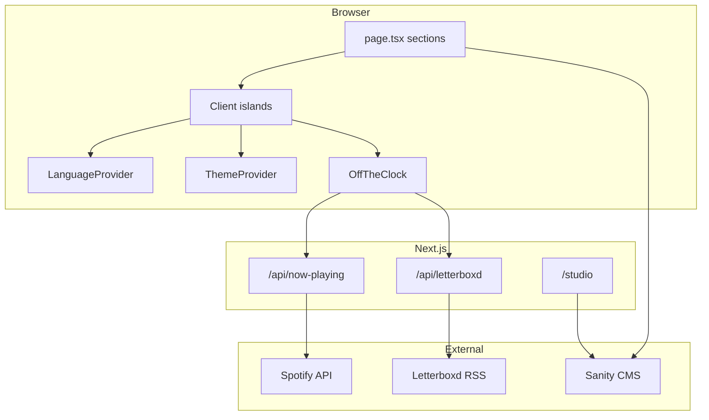
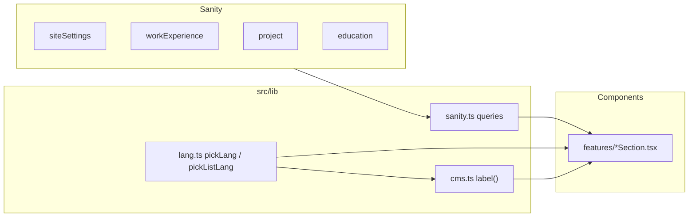
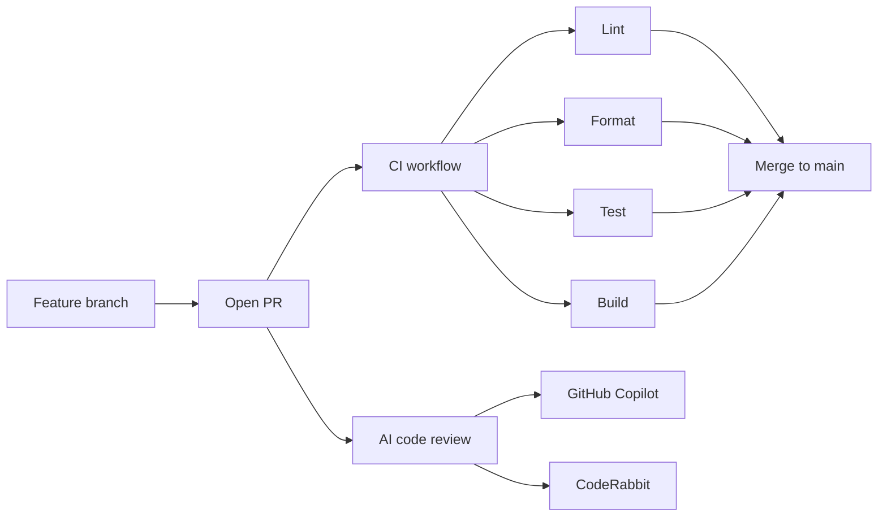
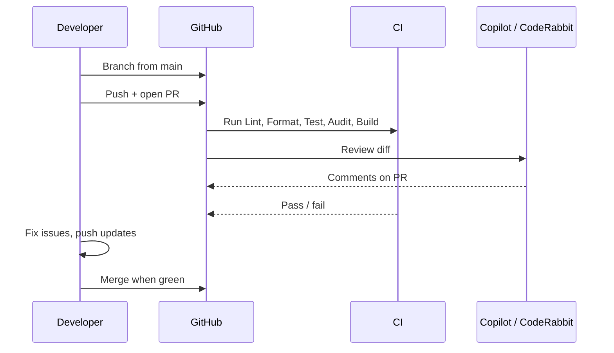

# nahom.no — developer docs

Extended documentation for the portfolio site. For a quick start, see the [root README](../README.md).

## Architecture

Single-page Next.js app. The server fetches Sanity content once in `src/app/page.tsx` and renders scroll sections. Client components handle theme, language, and live widgets (Spotify, Letterboxd).



## Content and i18n

Editable copy lives in Sanity. Norwegian uses parallel `*No` fields. Runtime language is stored in `localStorage` and resolved with helpers in `src/lib/lang.ts` and `src/lib/cms.ts`.



| Layer                       | Role                                            |
| --------------------------- | ----------------------------------------------- |
| Sanity `*No` fields         | Bilingual content edited in Studio              |
| `LanguageProvider`          | EN/NO toggle, persists choice                   |
| `pickLang` / `pickListLang` | Pick EN or NO string or list from CMS object    |
| `label()`                   | Section labels and nav copy from `siteSettings` |

## CI and pull requests

All changes to `main` go through pull requests. CI runs on every push and PR.



### CI jobs

Defined in [`.github/workflows/ci.yml`](../.github/workflows/ci.yml):

| Job    | Command                |
| ------ | ---------------------- |
| Lint   | `npm run lint`         |
| Format | `npm run format:check` |
| Test   | `npm test`             |
| Audit  | `npm run audit`        |
| Build  | `npm run build`        |

The workflow uses `permissions: contents: read` (least privilege).

### Branch protection

After merging once, run:

```bash
gh auth login
.github/setup-repo.sh
```

This script:

- Enables delete branch on merge and auto-merge
- Enables Dependabot security updates
- Creates or updates **Protect main** (PR required, Lint / Format / Test / Audit / Build, no force push)

You can also configure rules under **Settings → Rules → Rulesets** in GitHub.

## AI code review

Two reviewers run on pull requests:

### GitHub Copilot

Custom review instructions live in [`.github/copilot-instructions.md`](../.github/copilot-instructions.md). Enable Copilot code review in the repo **Settings → Copilot → Code review** (requires Copilot on the account or org).

### CodeRabbit

Configuration is in [`.coderabbit.yaml`](../.coderabbit.yaml) at the repo root.

1. Install the [CodeRabbit GitHub App](https://coderabbit.ai/) on this repository.
2. Merge `.coderabbit.yaml` to `main` (CodeRabbit reads config from the base branch).
3. Open a PR targeting `main` — reviews run automatically on each push.

If a PR is opened before the config is on `main`, comment `@coderabbitai review` once to trigger a review manually.

## Contributing workflow



1. Branch from `main`: `git checkout -b feat/my-change`
2. Make changes. Run locally: `npm run lint`, `npm run format:check`, `npm test`, `npm run build`
3. Push and open a PR (template in [`.github/pull_request_template.md`](../.github/pull_request_template.md))
4. Wait for CI and AI review
5. Merge when checks pass

## Tests

Tests live in [`tests/`](../tests/) and mirror `src/`. Vitest config is at the repo root.

```bash
npm test           # single run
npm run test:watch # watch mode
```

Prefer extracting pure logic into `src/lib/` (e.g. `lang.ts`, `letterboxd.ts`, `portrait-url.ts`) and testing there.

## Sanity checklist

When adding or changing CMS fields:

1. `sanity/schema.ts` — field definition
2. `src/types/sanity.ts` — TypeScript types
3. `src/lib/sanity.ts` — extend the relevant GROQ query
4. Section component(s) — read the new field
5. `scripts/seed.mjs` — seed EN + NO values (local only)

Publish documents in Studio after editing. Without a webhook, production cache revalidates hourly (`revalidate = 3600`).

### On-demand revalidation (webhook)

`POST /api/revalidate` clears the home page cache when Sanity content changes.

1. Generate a secret and add `SANITY_REVALIDATE_SECRET` in Vercel (and `.env.local` locally).
2. In [Sanity Manage](https://www.sanity.io/manage) → your project → **API** → **Webhooks**, create a webhook:
   - **URL:** `https://nahom.no/api/revalidate`
   - **Dataset:** production
   - **Trigger on:** Create, Update, Delete
   - **Filter:** `_type in ["siteSettings", "workExperience", "project", "education", "relevantClasses", "resume"]`
   - **Secret:** same value as `SANITY_REVALIDATE_SECRET`
   - **HTTP method:** POST
   - **API version:** v2021-03-25 or later

After setup, CMS publishes appear on the live site within seconds instead of waiting for the hourly cache.

## Key paths

| Area                    | Path                                                                             |
| ----------------------- | -------------------------------------------------------------------------------- |
| Page assembly           | `src/app/page.tsx`                                                               |
| i18n                    | `src/lib/i18n.tsx`, `src/lib/lang.ts`, `src/lib/cms.ts`                          |
| Sanity client + queries | `src/lib/sanity.ts`                                                              |
| Section components      | `src/components/features/`                                                       |
| API routes              | `src/app/api/now-playing/`, `src/app/api/letterboxd/`, `src/app/api/revalidate/` |
| CI                      | `.github/workflows/ci.yml`                                                       |
| AI review               | `.coderabbit.yaml`, `.github/copilot-instructions.md`                            |
